<p align="center">
  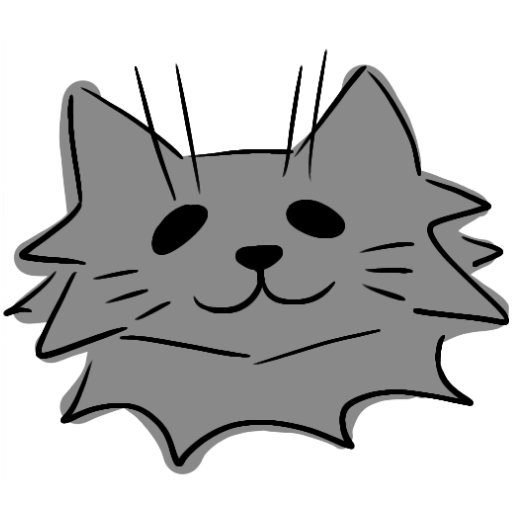
</p>

<h1 align="center">The Third Bowl</h1>

<p align="center">
  <strong>Emergency continuity for cats whose care lives in one person's head.</strong>
</p>

<p align="center">
  Food is the first bowl. Water is the second. Continuity is the third.
</p>

<p align="center">
  
  
  
  
  
  
  
  
</p>

## Why This Exists

Cats look independent until the one person who knows the routine cannot come home.

The hard part is not only feeding. It is knowing which bowl matters, where the cat hides, who may enter the home, which medicine must not be guessed, and which trusted human is actually responsible right now. The Third Bowl turns that fragile private knowledge into a controlled handoff system:

- A caregiver builds a structured Care Capsule for each cat.
- Trusted people join a per-cat Care Circle through the exact invited email.
- A recurring continuity ritual asks the caregiver to confirm availability.
- When a check-in is missed, backend state creates an incident and assigns responders.
- Responders see only the authorized Capsule sections, accept responsibility, confirm the cat was reached, and resolve the handoff.

The product is intentionally narrow: one emotionally clear problem, a real workflow, and a trust model that is visible in the product.

## Product Surfaces

<p align="center">
  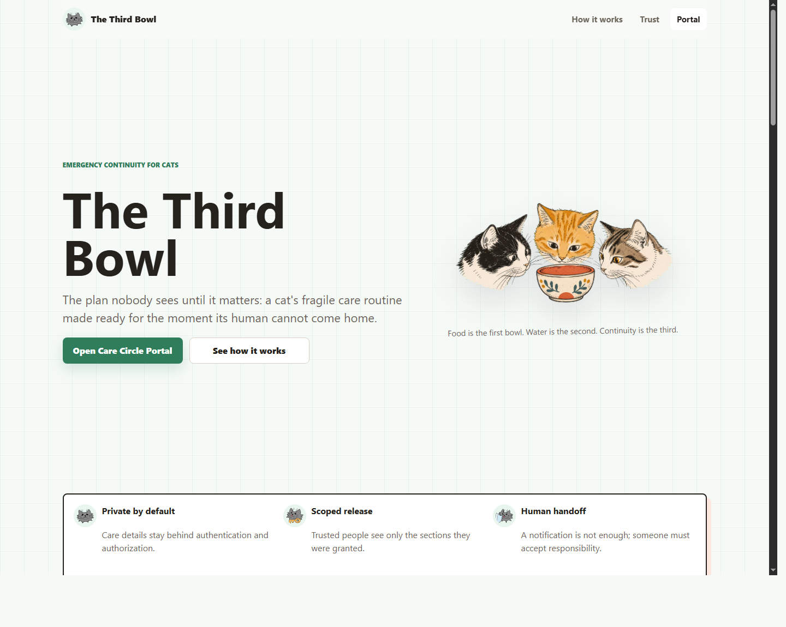
  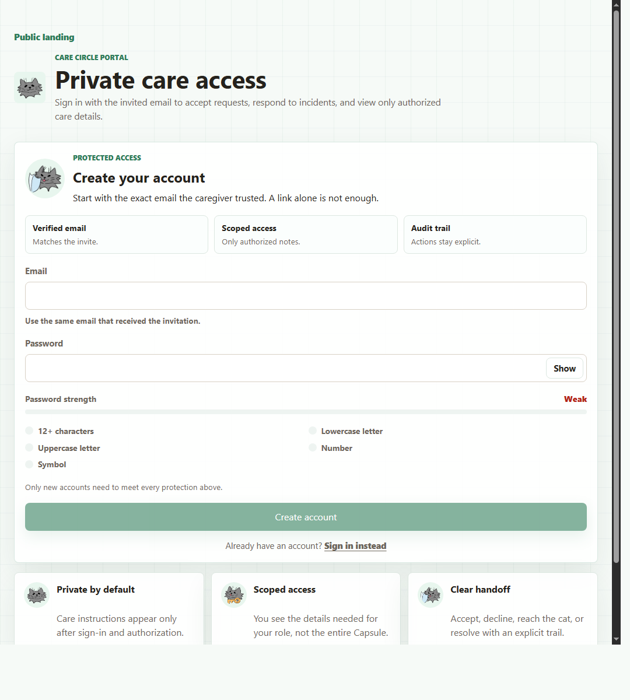
</p>

<p align="center">
  <em>Public landing for the story. Private portal for invited responders.</em>
</p>

<p align="center">
  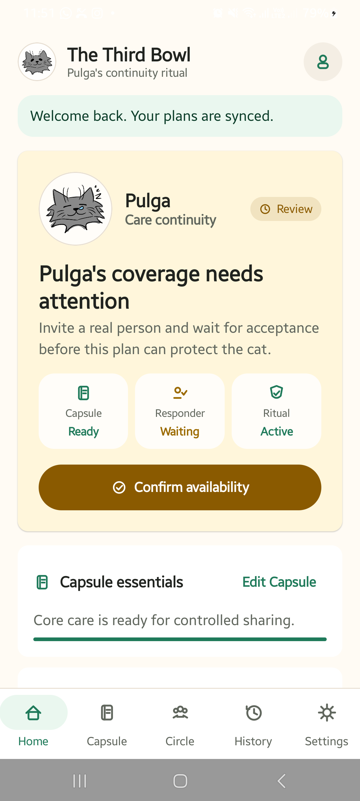
  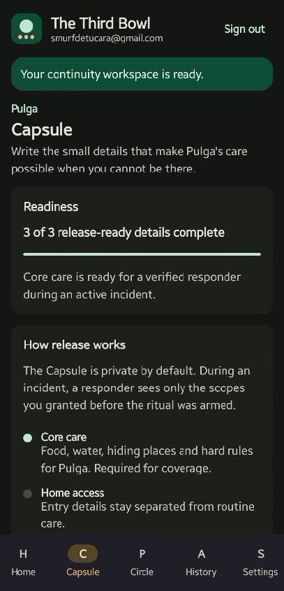
  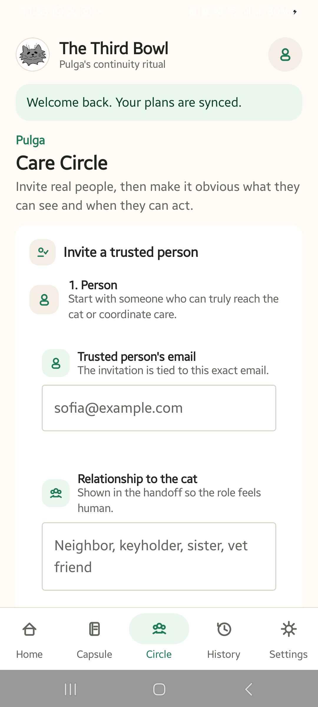
  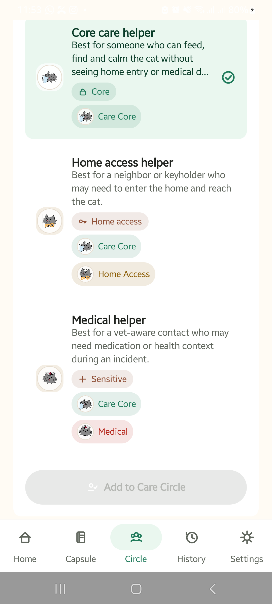
</p>

<p align="center">
  <em>Native Android caregiver workflow: readiness, Capsule, Care Circle, audit, and continuity state.</em>
</p>

## What Makes It Different

| Differentiator | Why it matters |
| --- | --- |
| Specific problem | The app is not generic pet care. It solves a high-stress knowledge transfer failure for cats. |
| Real trust boundary | Private care details are not shipped as a loose link. Access starts with authentication and invited email ownership. |
| Scoped disclosure | A neighbor, guardian, or medical helper can receive different sections of the Capsule. |
| Human responsibility | The flow does not stop at notification. A responder accepts responsibility, confirms the cat was reached, and resolves the incident. |
| Audit trail | Sensitive transitions are inspectable: Capsule changes, Circle changes, plan state, incidents, and handoffs. |
| Polished identity | The cat sprite system maps product states to recognizable emotional cues without making safety feel fake. |

## Architecture

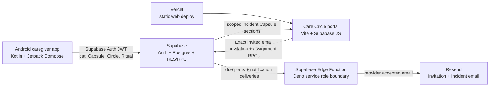

## Core Mechanics

| Mechanic | Implemented path |
| --- | --- |
| Cat profile | Android uses Supabase Auth and the `create_cat` RPC. |
| Care Capsule | Android uses Capsule RPCs; `HOME_ACCESS` and `MEDICAL` are stored as encrypted ciphertext and returned only through authorization-checked reads. |
| Care Circle | Android creates and lists invitation records with role and proposed scopes. |
| Exact-email portal | Web portal uses Supabase Auth and `list_my_invitation_records` for the signed-in user. |
| Continuity ritual | Android arms plans with `activate_continuity_plan` and completes check-ins with `complete_continuity_check_in`. |
| Missed-check-in incident | Edge Function calls `process_due_check_ins` and sends pending assignment emails when configured. |
| Responder handoff | Portal accepts assignments, records cat reached, resolves the handoff, and loads scoped Capsule sections. |
| Audit | Android loads `list_cat_audit_events` so care-sensitive actions stay visible. |

## Trust Model

The product is designed around minimum necessary disclosure.

- Android and browser clients use only the Supabase URL and publishable key.
- Service-role credentials stay inside the Supabase Edge Function environment.
- Portal sessions are not persisted to `localStorage`.
- The web entrypoint includes a restrictive CSP and referrer policy.
- Invitations are bound to normalized invited email ownership.
- Incident access is mediated by responder assignments and temporary section grants.
- Sensitive Capsule sections are encrypted at rest with server-managed field-level encryption.
- Sensitive responder actions are explicit: accept responsibility, confirm cat reached, resolve handoff.

This is not a veterinary diagnosis tool, not a replacement for emergency services, and not a promise that a notification alone protects an animal.

## Visual System

The sprites are part of the product language, not decoration. They identify states such as neutral profile, pending ritual, access, medical context, guard handoff, warning, and completion.

<p align="center">
  
  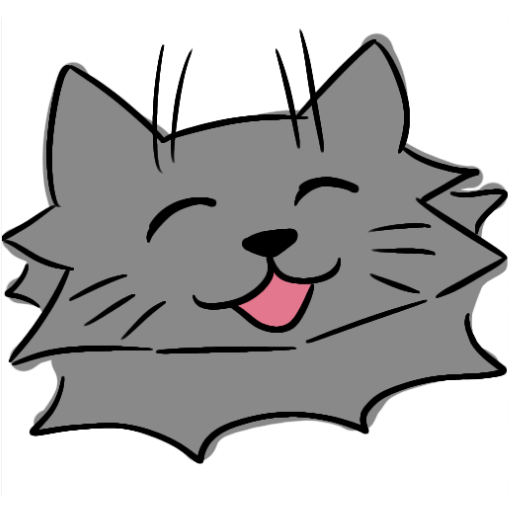
  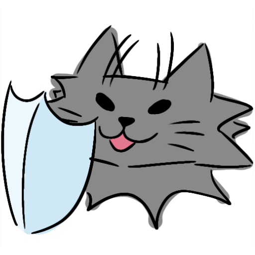
  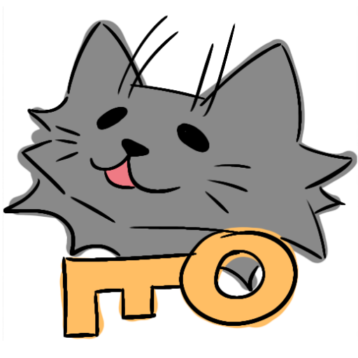
  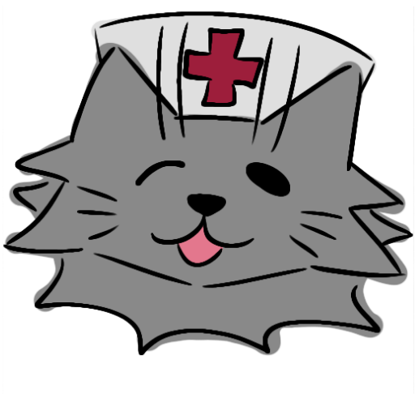
  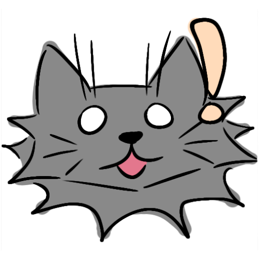
  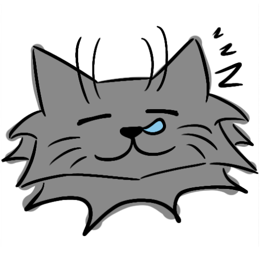
  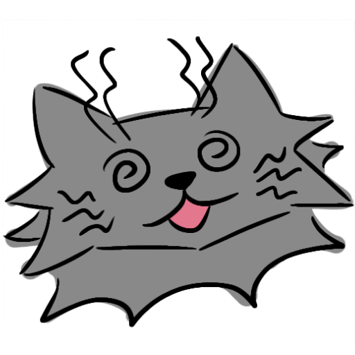
  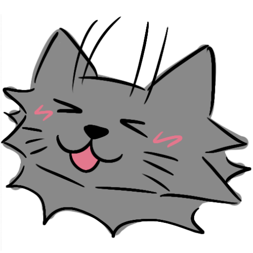
</p>

## Tech Stack

| Layer | Stack |
| --- | --- |
| Android | Kotlin, Jetpack Compose Material 3, Android Gradle Plugin, Supabase Kotlin, Ktor Android client |
| Web | Vite, vanilla JavaScript, Supabase JS, static CSP, generated favicon set |
| Backend | Supabase Auth, Postgres, RPC functions, RLS-backed tables, Edge Functions on Deno |
| Email | Resend-backed invitation and incident handoff emails |
| Deploy | Vercel static build from `website/`, Supabase Edge Function for server-side processing |
| Design assets | Hand-drawn cat sprites and hero art committed under `website/public/assets/` |

## Repository Layout

```text
TheThirdBowl/
  android-app/                              Native Android caregiver app
  website/                                  Vite landing page and Care Circle portal
  website/public/assets/                    Logo, favicon source, hero art, cat sprites
  readme-assets/                            README screenshots
  supabase/functions/process-due-check-ins/ Edge Function for due checks and email dispatch
  supabase/seed.sql                         Placeholder seed file
  SUBMISSION_AUDIT.md                       Submission readiness audit and remaining proof items
```

The Supabase schema SQL is managed by the project owner. Keep the deployed project aligned with the schema and environment requirements before running production-like flows.

## Local Setup

### Prerequisites

- Android Studio with embedded JBR/JDK 21 selected as the Gradle JDK.
- Android SDK API 36.
- Node.js 20 or newer.
- A Supabase project provisioned with the required schema and RPCs.

### Web

```bash
cd website
npm install
npm run dev
npm run build
```

On Windows PowerShell, use `npm.cmd` if script execution policy blocks `npm.ps1`.

### Android

Open `android-app/` in Android Studio, then set:

- Gradle JDK: Android Studio embedded JBR/JDK.
- Run target: Android emulator or physical device with USB debugging.

Command-line checks:

```bash
cd android-app
./gradlew :app:assembleDebug
./gradlew :app:testDebugUnitTest
```

### Vercel

The root `vercel.json` builds the static portal from `website/`:

- Install command: `npm install --prefix website`
- Build command: `npm run build --prefix website`
- Output directory: `website/dist`

After deploying, set `CARE_PORTAL_URL` in the Supabase Edge Function to the final portal route, for example:

```text
https://your-vercel-app.vercel.app/#/portal
```

### Supabase

Deploy the Edge Function after linking the Supabase project:

```bash
supabase link --project-ref <project-ref>
supabase functions deploy process-due-check-ins
```

Capsule field encryption requires a DB setting before writing or backfilling sensitive sections:

```sql
alter database postgres
  set "app.capsule_encryption_key" = 'REPLACE_WITH_LONG_RANDOM_SECRET';
```

Use `D:\hackthekitty\sql-manual\2026-07-07-capsule-encryption-key.sql` as the manual setup/backfill template.

### Supabase Edge Function

Required environment variables:

```text
SUPABASE_URL
SUPABASE_SERVICE_ROLE_KEY
CHECK_IN_PROCESSOR_SECRET
RESEND_API_KEY
EMAIL_FROM
CARE_PORTAL_URL
```

Optional for signed-in Android-triggered email dispatch:

```text
SUPABASE_ANON_KEY
SUPABASE_PUBLISHABLE_KEYS
```

Processor request:

```bash
curl -X POST "$SUPABASE_URL/functions/v1/process-due-check-ins" \
  -H "x-processor-secret: $CHECK_IN_PROCESSOR_SECRET" \
  -H "content-type: application/json" \
  -d "{}"
```

Email delivery and invitation verification grants are included in the committed migrations.

## Verification Evidence

Current local verification evidence:

| Area | Evidence |
| --- | --- |
| Web production build | `npm run build` passed in `website/`. |
| Web dependency audit | `npm audit --omit=dev` reported 0 vulnerabilities. |
| Android build | `.\gradlew.bat :app:assembleDebug` passed. |
| Android unit tests | `.\gradlew.bat :app:testDebugUnitTest` passed. |
| Android device run | App was run on a physical Android device through Android Studio. |
| Security posture | No service-role literal was found in client code during the audit. |

## Known Boundaries

These are the current limits to keep the product description accurate:

- Provider-delivered emails require deployed Resend secrets, verified sender domain, and live receipt proof.
- Android push notification delivery is not implemented in this repository.
- The web portal is a static client-side app, not an HttpOnly server-session app.
- Capsule field encryption requires `app.capsule_encryption_key` to be configured, plus backfill for any sensitive rows created before the encryption migration.
- The missed-check-in path is a processor/scheduler model, not a Temporal workflow.
- A clean hosted or local Supabase replay should be run after environment or schema changes.

## One-Line Pitch

The Third Bowl is a private continuity handoff system for cats: it turns one caregiver's invisible routine into scoped, auditable, responder-ready care when that person cannot come home.
